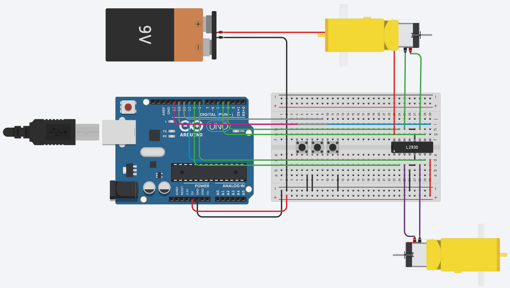

# RC-LLM

Voice-controlled RC car using a local LLM to translate natural language commands into motor actions.

## Goal

Build an RC car controlled by a small local LLM (via llama.cpp) that understands voice commands and converts them to motor instructions.

**Signal chain:** Voice → Speech-to-text (whisper.cpp) → Local LLM → Serial commands → Arduino → Motors

## What's Done

**Phase 1: Basic RC control with push buttons**

- [x] Arduino Uno + L298N motor driver + 2 DC motors
- [x] Toggle buttons for forward/reverse/stop

| L298N Module | Arduino Pin | Function          |
| ------------ | ----------- | ----------------- |
| ENA          | 10 (PWM)    | Motor A speed     |
| IN1          | 9           | Motor A direction |
| IN2          | 8           | Motor A direction |
| ENB          | 6 (PWM)     | Motor B speed     |
| IN3          | 4           | Motor B direction |
| IN4          | 3           | Motor B direction |

| Button  | Arduino Pin |
| ------- | ----------- |
| Forward | 12          |
| Reverse | 11          |
| Stop    | 13          |

## What's Next

- [ ] Serial command interface (host computer → Arduino)
- [ ] LLM integration with llama.cpp
- [ ] Voice input with whisper.cpp
- [ ] Obstacle avoidance with ultrasonic sensor
